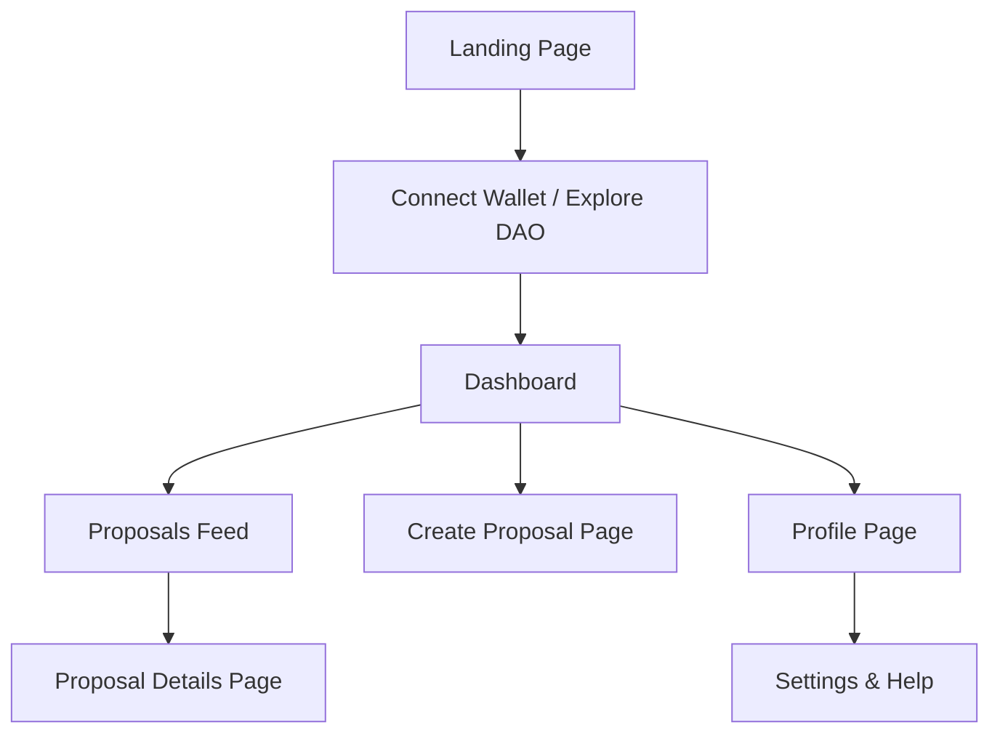

Below are some example diagrams and wireframes in Mermaid markdown format for both the frontend navigation and blockchain interaction flows. You can copy these Mermaid code blocks into your Markdown environment (or a tool like [Mermaid Live Editor](https://mermaid.live/)) to render and further customize the diagrams.

---

### 1. Frontend Navigation Flow Diagram



*Explanation:*  
This diagram shows a simple navigation flow from the landing page to the dashboard, with pathways toward viewing proposals, creating a new proposal, and managing user profiles and settings.

---

### 2. Blockchain Interaction Flow Diagram

```mermaid
flowchart TD
    UA[User (Browser)]
    A[Frontend App]
    B[Web3 Provider (e.g., MetaMask, WalletConnect)]
    C[Smart Wallet (EIP‑7702 Compliant)]
    D[DAO Smart Contracts]
    E[Blockchain Network]
    F[Event Notifications & UI Updates]

    UA --> A
    A --> B
    B --> C
    C --> D
    D --> E
    E --> F
    F --> A
```

*Explanation:*  
This flow diagram depicts how a user interacts with the frontend app, which uses a Web3 provider to connect to a smart wallet implementing EIP‑7702. The wallet then calls the DAO smart contracts deployed on the blockchain network, with results communicated back through event notifications to update the UI.

---

### 3. Integrated Architecture Diagram

```mermaid
graph LR
    subgraph Frontend
        A1[Landing Page]
        A2[Dashboard]
        A3[Proposal Creation Page]
        A4[Proposal Details Page]
        A5[Profile & Settings]
        A1 --> A2
        A2 --> A3
        A2 --> A4
        A2 --> A5
    end

    subgraph Blockchain
        B1[DAO Core Contract]
        B2[Voting Contract]
        B3[Smart Wallet Contract (EIP‑7702)]
        B1 --> B2
        B1 --> B3
    end

    A2 -- Interacts via Web3 --> C1[Web3 Provider]
    C1 -- Signs & Sends txs --> B3
    B3 -- Calls --> B1
    B3 -- Calls --> B2
```

*Explanation:*  
This integrated diagram shows the separation between the frontend components (pages like the Landing Page, Dashboard, Proposal Creation, Proposal Details, and Profile/Settings) and the backend blockchain components (DAO, Voting, and Smart Wallet contracts). The Web3 Provider acts as the communication layer that connects them.

---

These Mermaid diagrams should serve as a strong starting point and can be adjusted based on your development needs and further architectural decisions. Let me know if you need further customization or additional diagrams for other aspects of your platform!