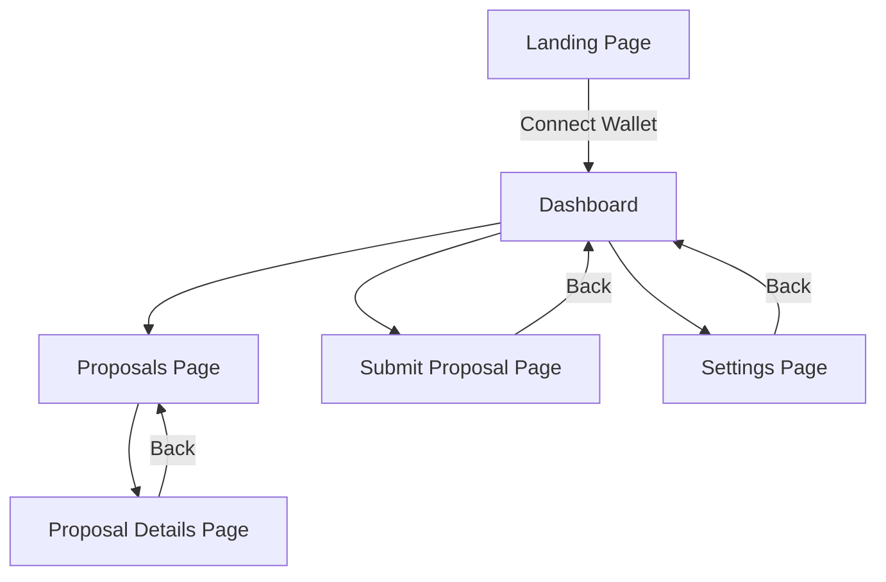
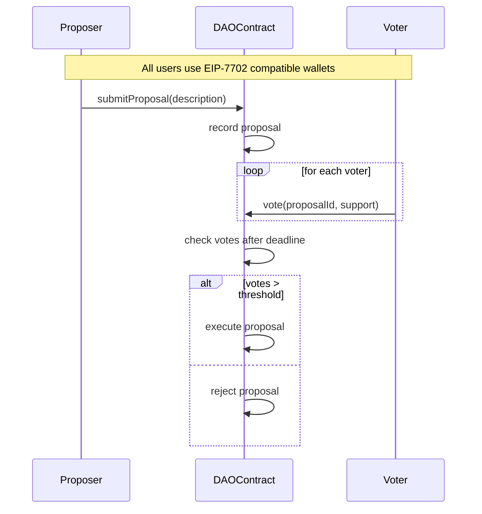

Web3 DAO Proposal Platform Diagrams
Below are diagrams for your web3 DAO proposal platform with EIP-7702 integration, created using Mermaid Markdown format. These diagrams aim to make the platform’s frontend navigation and blockchain interactions clear, especially for non-web3 users.
Key Points

Navigation Flowchart: Shows how users move between pages like the Dashboard and Proposals Page.
Proposal Process: Illustrates the steps from submitting a proposal to voting and execution.
EIP-7702 Support: Ensures easy wallet interactions for beginners.
Mermaid Limitation: Mermaid can’t create detailed UI layouts, so diagrams focus on flows and processes.

Frontend Navigation Flowchart
This flowchart outlines how users navigate the platform’s pages, starting from the Landing Page and moving through key sections like the Dashboard and Proposals Page. It’s designed to be intuitive, with EIP-7702 wallets simplifying access for non-web3 users.

Blockchain Proposal Process
This sequence diagram shows the interaction between users and the DAO smart contract, from submitting a proposal to voting and execution. It highlights how EIP-7702 wallets streamline transactions for all users.
sequenceDiagram
    participant Proposer
    participant DAOContract
    participant Voter
    note over Proposer,Voter: All users use EIP-7702 compatible wallets
    Proposer->>DAOContract: submitProposal(description)
    DAOContract->>DAOContract: record proposal
    loop for each voter
        Voter->>DAOContract: vote(proposalId, support)
    end
    DAOContract->>DAOContract: check votes after deadline
    alt votes > threshold
        DAOContract->>DAOContract: execute proposal
    else
        DAOContract->>DAOContract: reject proposal
    end

Notes
You can render these diagrams using the Mermaid Live Editor. For detailed UI wireframes (e.g., button layouts), consider tools like Figma or PlantUML, as Mermaid focuses on flows and processes.

Comprehensive Design Report for DAO Proposal Platform Diagrams
Introduction
Creating a web3 DAO proposal platform with EIP-7702 smart wallet integration requires clear visualizations to understand user interactions and blockchain processes. This report provides two Mermaid Markdown diagrams: a flowchart for frontend navigation and a sequence diagram for the blockchain proposal process. These diagrams aim to make the platform accessible, especially for non-web3 users, by leveraging EIP-7702’s user-friendly features like gasless transactions.
Frontend Navigation Flowchart
Purpose
The flowchart illustrates how users navigate the platform’s frontend, ensuring a seamless experience from connecting a wallet to engaging with proposals. It reflects the structure outlined in the platform’s design, covering key pages like the Landing Page, Dashboard, and Proposals Page.
Diagram

Explanation

Landing Page: The entry point where users connect their EIP-7702 compatible wallet, designed to guide non-web3 users with clear instructions.
Dashboard: The central hub linking to Proposals, Submit Proposal, and Settings pages, showing active proposals and user voting power.
Proposals Page: Lists all proposals with filters (e.g., Active, Executed), allowing users to select a proposal for details.
Proposal Details Page: Displays full proposal information and a voting interface, with a “Back” option to return to the Proposals Page.
Submit Proposal Page: Contains a form for creating proposals, returning users to the Dashboard after submission.
Settings Page: Manages account preferences, with a “Back” link to the Dashboard.
UX Considerations: The flow is simple, with the Dashboard as the main hub, ensuring non-web3 users can navigate without confusion. EIP-7702 wallets reduce barriers by simplifying wallet connections.

Design Details
The navigation structure is based on common DAO platforms like Aragon, emphasizing accessibility. Each page is designed to be responsive, with tooltips and guides for beginners. The flowchart uses Mermaid’s top-down layout to clearly show page transitions, making it easy to understand the user journey.
Blockchain Proposal Process Sequence Diagram
Purpose
The sequence diagram details the blockchain interactions for submitting, voting on, and executing proposals. It shows how the DAO smart contract processes actions, with EIP-7702 wallets enhancing the experience for all users.

Explanation

Participants:
Proposer: A DAO member submitting a proposal.
DAOContract: The smart contract managing governance.
Voter: DAO members voting on proposals.

Process:
The Proposer calls submitProposal(description), sending the proposal to the DAOContract.
The DAOContract records the proposal, assigning it an ID and voting period.
Voters call vote(proposalId, support) in a loop, indicating support or opposition.
After the voting deadline, the DAOContract checks the vote tally.
If votes exceed the threshold, the proposal is executed (e.g., funds transferred); otherwise, it’s rejected.

EIP-7702 Integration: A note indicates all users use EIP-7702 wallets, which support features like gasless transactions, making interactions smoother for non-web3 users.

Design Details
The sequence diagram is inspired by Ethereum DAO governance models, as described on Ethereum.org. It simplifies the process to focus on key actions, using Mermaid’s sequence syntax to show interactions clearly. The loop for voters represents multiple participants, and the conditional block (alt) shows the decision logic for execution.
Technical Considerations
Mermaid Limitations
Mermaid excels at flowcharts and sequence diagrams but lacks support for traditional UI wireframes (e.g., button layouts), as noted in a Mermaid GitHub issue. For detailed UI mockups, tools like Figma or PlantUML’s Salt are recommended. The provided diagrams focus on functional flows to align with Mermaid’s strengths.
EIP-7702 Integration
EIP-7702 wallets, as outlined in the EIP-7702 Overview, allow standard Ethereum transactions with added features like gas sponsorship. The sequence diagram notes their use, ensuring the platform is accessible to non-web3 users by reducing the need to manage gas fees.
Rendering Instructions
To visualize these diagrams, paste the Mermaid code into the Mermaid Live Editor. This tool renders the diagrams as SVGs, which can be embedded in documentation or websites. For integration, use Mermaid’s JavaScript library, as described in the Mermaid Usage Guide.
Additional Diagrams Considered
Other diagram types were explored but not included:

UI Component Diagram: A flowchart to show page components (e.g., Sidebar, Main Content) was considered but deemed less effective, as Mermaid can’t visually layout UI elements like a wireframe tool.
Class Diagram: A smart contract class diagram could detail the DAOContract’s structure but was omitted, as the sequence diagram better captures user interactions.
Gantt Chart: A timeline for the proposal lifecycle was possible but less relevant than the sequence diagram for showing blockchain processes.

Implementation Notes

Frontend: The navigation flowchart assumes a single-page application built with frameworks like React, using libraries like ethers.js for wallet interactions. The EIP-7702 wallet connection is handled via a modal, guiding users through setup.
Blockchain: The sequence diagram aligns with the governance contract described earlier, using functions like submitProposal and vote. The contract is deployable on Ethereum testnets like Sepolia, which supports EIP-7702, as noted in external guides.
Testing: Test the diagrams by rendering them in the Mermaid Live Editor. For the platform, deploy contracts on a testnet and simulate user flows to ensure EIP-7702 compatibility.

Table: Diagram Components

Diagram Type
Purpose
Key Elements
EIP-7702 Relevance

Navigation Flowchart
Show frontend page transitions
Landing Page, Dashboard, Proposals Page, etc.
Simplifies wallet connection

Proposal Sequence
Illustrate blockchain interactions
Proposer, DAOContract, Voter, voting logic
Enables gasless transactions for users

Conclusion
The provided Mermaid diagrams offer a clear view of the DAO proposal platform’s frontend navigation and blockchain processes. The navigation flowchart ensures users can easily move between pages, while the sequence diagram clarifies how proposals are managed on-chain. By integrating EIP-7702 wallets, the platform becomes more accessible to non-web3 users, aligning with the goal of inclusive governance. For further UI wireframing, consider supplementing with tools like Figma or PlantUML.

